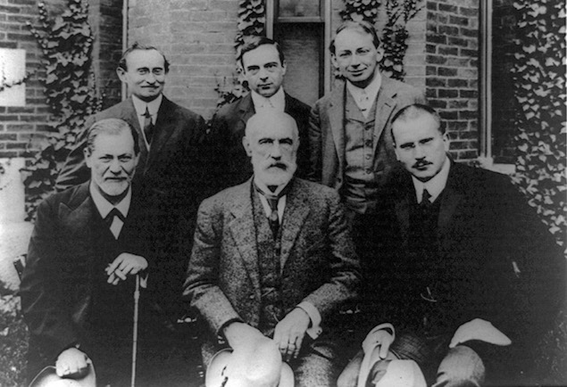

Chapter  6: curriculum: Psychotherapy
------------------------------------

[Psychotherapy](../category/curriculum/psychotherapy/index.html)
----------------------------------------------------------------

Sigmund Freud
=============

He described himself as an obsessional neurotic.

For although the father of modern psychology told us so much about our inner lives, he was touchingly vulnerable himself. 

Sigmund Schlomo Freud was born to a middle-class Jewish family in 1856, in what is now the Czech Republic. He had a deep love for his mother, who called him her “golden Sigi”, and an equally deep hostility to his father, who may have threatened to cut off little Sigi’s penis if he didn’t stop touching it. 

His professional life was not an immediate success. As a young medical student, he dissected hundreds of male eels in an unsuccessful attempt to locate their reproductive organs, and ultimately failed to publish on the topic. He then turned his attention to a new exciting anaesthetic drug, trumpeting its amazing properties. But unfortunately cocaine turned out to be dangerous and addictive, and Freud had to stop advocating its medical use.

A few years later, he began at last to outline the discipline that would ultimately make his name: a new psychological medicine he called psychoanalysis. The landmark study was his 1900 book *The Interpretation of Dreams*. Many others followed, most importantly *The Psychopathology of Everyday Life* (1901), *The Cases of ‘Little Hans’ and the Rat Man’* (1909), *Beyond the Pleasure Principle* (1920) and *Civilisation and Its Discontents* (1930).

Despite his success as a doctor, author, and psychological expert, he was often unhappy. He was a workaholic and confided to a friend, “I cannot imagine life without work as really comfortable.” During a particularly strenuous part of his research he recorded, “The chief patient I am preoccupied with is myself…”

He could be very jealous of his colleagues. He once fainted watching Carl Jung give a talk, and he forbid nearly all his students from even seeing Alfred Adler. He was convinced he would die between 61 and 62 and had great phobias about those numbers. He once panicked during a stay in Athens when his hotel room’s number was 31, half of 62. He soothed himself with his beloved cigar, but he was also very self-conscious about it, because he thought it was a replacement for his earlier masturbation habits. 

##### Freud with some of his colleagues. He was especially jealous of Carl Jung (far bottom right)

Yet his private sorrows and anxieties were in fact part of his greatest contribution: his investigation into the strange unhappiness of the human mind. His work shows us that the conscious, rational part of the mind is, in his words, “not even master in its own house.” Instead, we are governed by competing forces, some beyond our conscious perception. We should attend to him-–however strange, off-putting, or humorous some of his theories may seem–because he gives us a wonderfully enlightening account of why being human is very difficult indeed. 

**PLEASURE VS. REALITY**

Freud first put forward a theory about this inner conflict in his essay “Formulations on the Two Principles of Mental Functioning,” written in 1911. There he described the “pleasure principle,” which drives us towards pleasurable things like sex and cheeseburgers and away from unpleasurable things like drudgery and annoying people. Our lives begin governed by this instinct alone; as infants we behave more or less solely according to the pleasure principle. As we grow older, our unconscious continues to do the same, for “the unconscious is always infantile.” 

##### Babies mostly follow the pleasure principle and directly seek pleasure while avoiding pain.

The problem, Freud said, is that as we get older we can’t simply follow the pleasure principle, as it would make us do crazy things like sleep with members of own family, steal other people’s cheeseburgers, and kill people who annoy us. We need to take into account what he called “the reality principle.” 

Ideally, we adjust to the demands of the reality principle in a useful, productive way: “a momentary pleasure, uncertain in its results, is given up, but only to gain along the new path an assured pleasure at a later time.” This is the underlying principle of so much of religion, education, and science: we learn to control ourselves and put away short-term pleasure to achieve greater (and usually more socially-acceptable) pleasure in the long run. 

But Freud noticed that in practice, most of us struggle with this. He believed that there were better and worse kinds of adaptations to reality; he called the troublesome ones neuroses. In cases of neuroses, we put aside–or repress–the pleasure drive, but at a cost. We become unhappy or even–in a sense–crazy, but we don’t understand the symptoms. 

For example, we might struggle to repress our attraction to people who are not our partner. However, this struggle is too painful to experience directly all the time, so we’ll unconsciously repress it. Instead, we’ll experience delusions of jealousy about our partner, and become convinced they are cheating on us. This is a projection of our true anxiety. It will quell some of our guilt about our wandering eye, but it may also drive us mad. It’s an adaptation to the challenges we face–but, of course, it isn’t really a very good one. 

Freud thought that life was full of these kinds of neuroses, brought on as the result of a conflict between our “id,” driven by the pleasure principle, and the “ego” , which rationally decides what we should do about the drives of the id. Other times neuroses come about because of a struggle between the ego and the superego, which is our moralistic side. 

In order to understand these dynamics, we’ll usually need to think back to the time in our lives that generated so many of our neuroses:

**CHILDHOOD**

Childhood is really the time when we learn different adaptations to reality, for the better or (often) for the worse. As babies, we emerge full of raw, unprincipled desires. As we are raised, however, we are “civilised” and thus brought into line with social reality. If we don’t adjust well, trouble will emerge. 

First in our psychological history comes what Freud termed the “oral phase,” where we deal with eating. We’re born wanting to drink from the breast whenever we want. Yet over time, we have to be weaned. This is very difficult for us. If our parents aren’t careful (or worse, if they’re a little sadistic) we might pick up all kinds of neuroses: internalised self-denial, using food to calm ourselves down, or hostility to the breast. Most of all, we struggle with dependence. If our mothers wait too long, we may grow up to be very demanding and surprised when the outside world doesn’t provide everything we want. Or, we may learn to distrust dependence on others altogether.

Then comes the “anal phase” (more commonly known as “potty-training”) where we face the challenges of defecation. Our parents tell us what to do and when to go–they tell us how to be good. At this phase we begin to learn about testing the limits of authority. We might, for example, choose to withhold out of defiance. We may then, as adults, become “anally retentive” and excessively tidy. We also might hold back from spending money. Alternatively, if our parents are too permissive, we may test authority and other people’s boundaries too frequently. This leads not only to “making messes” as a toddler, but also to being spendthrift and inconsiderate when we are older. 

Freud says that the way our parents react matters a great deal. If they shame us when we fail to comply, we may develop all kinds of fears and anxieties. But at the same time we need to learn about boundaries and socially-appropriate behaviour. In short, potty training is the prime time for navigating the conflict between our own pleasure seeking and the demands of our parents. We have to adapt to these demands appropriately, or we’ll end up with serious problems.

##### Freud and his family; the family as the focal scene of neurosis formation.

Next comes the “phallic phase” (it goes until about age 6), where we address the problems of genital longings and newly-emerged, impossible sexual wishes. Freud shocked his contemporaries by insisting that little children are sexual: they have sexual feelings, they get erections, they masturbate, they want to rub themselves on various objects and people (even now, the idea makes people uncomfortable). In Freud’s time, the kid would be told to stop it violently; now we tell them this gently. But the point is the same: we can’t permit childhood sexuality. For the child, this means that a very powerful part of their young self is firmly repressed. 

This is even more complicated because children direct their sexual impulses towards their parents. Freud described what he called the Oedipus complex (named after the Greek tragic figure), in which we are all unconsciously predisposed towards “being in love with the one parent and hating the other.” It sounds very strange, but it’s worth attending to all the same. 

It starts like this: as children, most of us are very attached to our mothers. In fact, Freud says that little boys automatically direct their primitive sexual impulses towards her. Yet no matter how much she loves us, mum will always have another life. She probably has a relationship (likely with our dad) or if not, a number of other priorities that leave us feeling frustrated and abandoned as children. This makes our infant selves feel jealous and angry – and also ashamed and guilty about this anger. A small male child will particularly feel hatred towards the person who takes mum away and also be afraid that that person might kill him. This entire complex–now the word makes sense–provides a huge amount of anxiety for a small child already. (In Freud’s view, little girls have it no easier–they just have a slightly different complex).

##### Childhood is fraught with jealousy and related attachment issues, especially towards our mothers.

Then comes the problem of actual incest. Adults should not have sex with children; this is a very serious incest taboo on which society depends. We’re not supposed to have sex with people we’re related to either. But even though we claim to all be horrified by it, as if incest were simply the last thing on our mind, Freud reminds us that things are never made into a taboo unless quite a lot of people are keen on breaking the taboo in their unconscious. This explains all the hysteria around incest and sex with children–the idea of it is lurking somewhere in the back of our minds. 

In order to prevent sex in the family, the child has to be weaned off the desire to have sex with mum or dad. Mum or dad need also to be kind and not make them feel guilty about sex. But all kinds of things can go terribly wrong. 

Most of us experience some form of sexual confusion around our parents that later ties into our ideas of love. Mum and dad both give us love, but they mix it in with various kinds of troubling behaviour. Yet because we love them and depend on them, we remain loyal to them and also to their destructive patterns. So for example, if our mother is cold and makes belittling comments, we will be apt nevertheless to long for her or even find her very nice. As a result, however, we may be prone to always associate love with coldness.

**ADULTHOOD**

Ideally, we should be able to have genital sex without trouble, and in the long term, fuse love and sex together with someone who is kind. Of course, it rarely happens.

Typically, we can’t fuse sex and love: we have a sense that sex doesn’t belong with tender feelings. “A man of this kind will show a sentimental enthusiasm for women whom he deeply respects but who do not excite him to sexual activities,” noted Freud, “and he will only be potent with other women whom he does not ‘love’ but thinks little of or even despises.” 

##### Freud compared the issues we so often have with intimacy to hedgehogs in the winter: they need to cuddle for warmth, but they also can’t come too close because they’re prickly. He borrowed this analogy from another Great Thinker, Schopenhauer.

Neuroses aren’t just created within individuals. The whole of society keeps us neurotic. In his book *Civilisation and its Discontents* (1930), Freud wrote that a degree of repression and psychological dysfunction is simply the cost of living in a society. Society  insists on regulating sex, imposes the incest taboo, requires us to put off our immediate desires, demands that we follow authority and makes money available only through work. A non-repressive civilisation is a contradiction.

**ANALYSIS**

Freud attempted to invent a cure for neurosis: psychoanalysis. But from the outset, the offering was very limited. He thought the patient should be under fifty, or else their minds would be too rigid. It was very expensive, especially since he thought his patients should come four times a week. And he was quite pessimistic about the outcome: he believed that at best he could transform hysterical unhappiness into everyday misery. Nevertheless, he thought that with a little proper analysis, people could uncover their neuroses and better adjust to the difficulties of reality.

##### Freud’s office in London, with a couch for his patients to sit or lie on as they were analysed

Here are some of the things Freud sought to “analyse” in his sessions:

**DREAMS**

Freud believed that sleep was a chance for us to relax from the difficulties of being conscious, and especially to experience what he called wish-fulfilment. It might not seem obvious at first. For example, we might think we dream about failing our A-levels simply because we’re stressed at work. But Freud tells us that we actually get these kinds of dreams because some part of us wishes that we’d failed our A-levels, and thus didn’t have all the responsibilities of adulthood, our job, and supporting our family. Of course, we also have more intuitive wish-fulfilment dreams, like the ones where we sleep with a beguiling co-worker we had never, in the day, known we liked.

Once we wake, we must return to the world and the dictates of our moralistic superego–so we usually repress our dreams. This is why we quickly forget the really exciting dreams we had. 

**PARAPRAXES**

Freud loved to notice how his patients used words. He thought it was particularly telling when they had a slip of the tongue, or a parapraxis (we now call these revealing mistakes “Freudian slips”). For example, Freud wrote of a man who asked his wife (whom he didn’t actually like) to come join him in America. The man meant to suggest that she take the ship the Mauretania, but in fact he wrote that she should come on the Lusitania – which was sunk off the coast of Ireland by a German submarine in WWI, resulting in the loss of all on board. 

**JOKES**

Freud thought that humour was a psychological survival-mechanism. In his *Jokes and their Relation to the Unconscious,* he explained: “Jokes make possible the satisfaction of an instinct (whether lustful or hostile) in the face of an obstacle that stands in its way.” In short, jokes–like dreams–allow us to bypass authority and satisfy wishes.

\*\*

In 1933, the Nazis rose to power. “What progress we are making,” Freud told a friend. “In the Middle Ages they would have burnt me; nowadays they are content with burning my books.” Even he failed to see what the world was up against with the Nazis. Elite friends and a sympathetic Nazi officer helped him and his family escape to London, where he lived for the rest of his life. He died in 1939 of jaw cancer. 

Following in Freud’s footsteps, other analysts developed new psychoanalytic techniques, and eventually the wide and varied field of modern psychiatry. Much of modern therapy is very different from Freud’s, but it began with his premise of discovering the dark and difficult parts of our inner lives and unwinding them, slowly, under the guidance of a trained listener. 

We may think we’ve outgrown him, or that he was ridiculous all along. There’s a temptation to say he just made everything up, and life isn’t quite so hard as he makes it out to be. But then one morning we find ourselves filled with inexplicable anger towards our partner, or running high with unrelenting anxiety on the train to work and we’re reminded all over again just how elusive, difficult, and Freudian our mental workings actually are. We could still reject his work, of course. But as Freud said, “No one who disdains the key will ever be able to unlock the door.”

